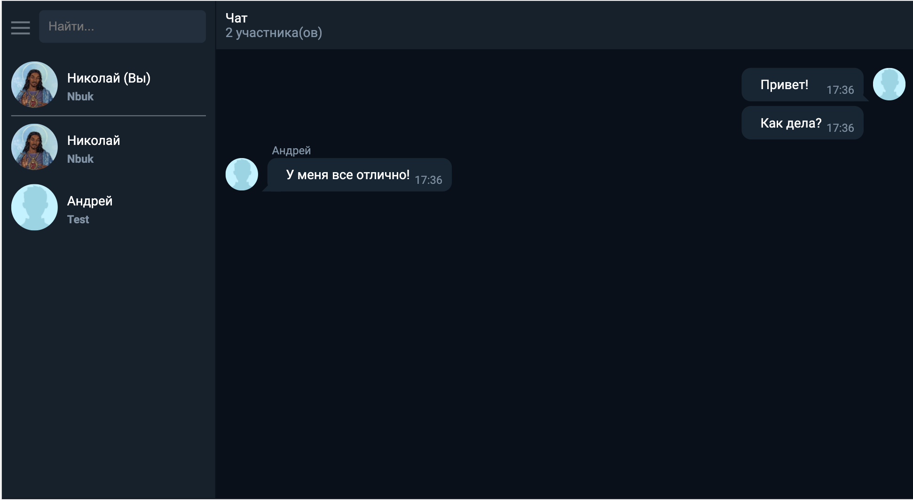

# Web chat

### Описание

Простой веб-чат. Есть возможность смены аватарки.  

### Зависимости

* `express`
* `socket.io`

### Доступные команды

* `npm install` - установить зависимости
* `npm start` - запустить сервер

Чат будет доступен по адресу: localhost:3000
